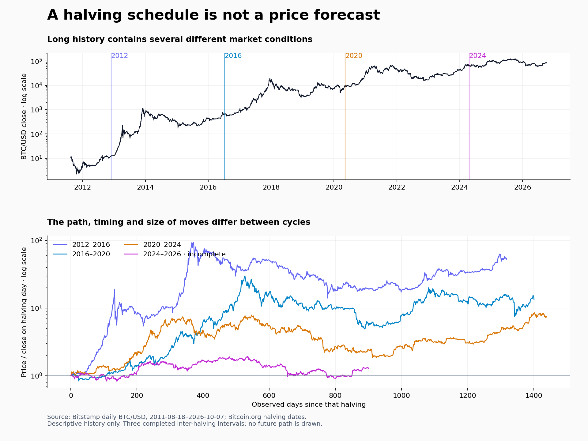

# Cycles, seasonality and longer-history research — October 8, 2026

**0 historical candidates passed the joint screen across 1,168 cycle/seasonality comparisons.** No cycle rule is authorized to alter live forecasts, alerts, orders, leverage, stops or holding periods.

This extends the earlier study; it does not assume that a four-year price pattern must repeat. Bitcoin has a block-subsidy halving schedule. A recurring price cycle is a separate empirical hypothesis.



## Actual history available

| Series | First observation | Last observation | Valid daily prices |
|---|---|---|---:|
| CM_BTC | 2010-07-18 | 2026-05-23 | 5,789 |
| CM_DOGE | 2014-01-23 | 2026-05-23 | 4,504 |
| CM_ETH | 2015-08-08 | 2026-05-23 | 3,942 |
| CM_LTC | 2013-04-01 | 2026-05-23 | 4,801 |
| CM_XRP | 2014-08-15 | 2026-05-23 | 4,300 |
| BITSTAMP_BTC | 2011-08-18 | 2026-10-07 | 5,530 |
| BINANCE_AAVE | 2020-10-16 | 2026-10-07 | 2,182 |
| BINANCE_ADA | 2020-01-31 | 2026-10-07 | 2,441 |
| BINANCE_ARB | 2023-03-23 | 2026-10-07 | 1,294 |
| BINANCE_AVAX | 2020-09-23 | 2026-10-07 | 2,205 |
| BINANCE_BNB | 2020-02-10 | 2026-10-07 | 2,431 |
| BINANCE_BTC | 2020-01-01 | 2026-10-07 | 2,472 |
| BINANCE_DOGE | 2020-07-10 | 2026-10-07 | 2,280 |
| BINANCE_ETH | 2020-01-01 | 2026-10-07 | 2,472 |
| BINANCE_HBAR | 2021-03-17 | 2026-10-07 | 2,025 |
| BINANCE_HYPE | 2025-05-30 | 2026-10-07 | 495 |
| BINANCE_LINK | 2020-01-17 | 2026-10-07 | 2,455 |
| BINANCE_SOL | 2020-09-14 | 2026-10-07 | 2,209 |
| BINANCE_SUI | 2023-05-03 | 2026-10-07 | 1,253 |
| BINANCE_XLM | 2020-01-20 | 2026-10-07 | 2,447 |
| BINANCE_XRP | 2020-01-06 | 2026-10-07 | 2,461 |
| BINANCE_ZEC | 2020-02-05 | 2026-10-07 | 2,431 |
| AAPL | 2000-01-03 | 2026-10-07 | 6,731 |
| AMD | 2000-01-03 | 2026-10-07 | 6,731 |
| AMZN | 2000-01-03 | 2026-10-07 | 6,731 |
| BITX | 2023-06-27 | 2026-10-07 | 824 |
| CONL | 2022-08-10 | 2026-10-07 | 1,044 |
| GLD | 2004-11-18 | 2026-10-07 | 5,505 |
| HOOD | 2021-07-29 | 2026-10-07 | 1,304 |
| META | 2012-05-18 | 2026-10-07 | 3,617 |
| MSFT | 2000-01-03 | 2026-10-07 | 6,731 |
| MSTU | 2024-09-18 | 2026-10-07 | 515 |
| NVDA | 2000-01-03 | 2026-10-07 | 6,731 |
| NVDL | 2022-12-13 | 2026-10-07 | 957 |
| QQQ | 2000-01-03 | 2026-10-07 | 6,731 |
| SOXL | 2010-03-11 | 2026-10-07 | 4,170 |
| SPY | 2000-01-03 | 2026-10-07 | 6,731 |
| SQQQ | 2010-02-11 | 2026-10-07 | 4,189 |
| TLT | 2002-07-30 | 2026-10-07 | 6,087 |
| TQQQ | 2010-02-11 | 2026-10-07 | 4,189 |
| TSLA | 2010-06-29 | 2026-10-07 | 4,094 |
| TSLL | 2022-08-09 | 2026-10-07 | 1,045 |
| UUP | 2007-03-01 | 2026-10-07 | 4,933 |

Coin Metrics and Bitstamp are independent data-source cross-checks of the same Bitcoin market, not independent market cycles. Their series are not spliced. Coin Metrics community price archives available in this run stop in May 2026; Binance/Bitstamp/reference equities continue into October. Younger assets cannot supply cycles before their listing. The stock/ETF history includes market proxies and Robinhood-relevant instruments; it is not a claim about account-specific eligibility or executable prices.

## Predeclared model comparison

- Expanding history; refit once per quarter. At least 730 fully observed training outcomes after the feature warm-up. Labels maturing on or after the fit date are excluded. No random train/test shuffle.
- Forecast 1, 7, 30 and 90 calendar days for crypto, or sessions for stocks. Research entry is the next observed close, so the close used to form a feature cannot also be its assumed entry fill.
- State model: prior price momentum, 200-period trend, drawdown and volatility, plus lagged BTC, stock, bond, gold and dollar proxies.
- Add annual/weekly seasonality, phase since the last known halving, both together, or their interactions with trend and volatility. The 1,461-day phase is a fixed hypothesis; the realized next halving date and future peaks/troughs are never inputs.
- Direction: regularized logistic regression (fixed C=0.01), compared with expanding and recent base rates and the state model. Volatility: ridge regression of future log realized variance (fixed alpha=100), training-only retransformation, compared with 30-period realized variance, an EWMA and the state model. Score uncapped QLIKE, not a more convenient capped objective.
- Train-only imputation/scaling. Additional full-day lag for reference markets. Missing crypto holding paths are rejected. No Bitcoin phase is invented before genesis.
- Paired 90-day blocks (180 days for 90-period forecasts), joint Holm correction over both targets, every tested source, asset, feature set and horizon. Also require positive gains over all three comparators in every adequately represented halving era (at least two eras, at least 180 predictions each). Block statistics are approximate diagnostics, not a trading guarantee.

## Results for the core assets

Positive values below mean lower loss than the state-only model. They are descriptive averages; a positive cell alone does not pass the joint gate.

| Asset/source | Horizon | Seasonality Brier gain | Cycle Brier gain | Combined Brier gain | Interaction Brier gain |
|---|---:|---:|---:|---:|---:|
| CM_BTC | 1 | -0.00133 | -0.00013 | -0.00150 | -0.00264 |
| CM_BTC | 7 | -0.00242 | +0.00167 | -0.00143 | -0.00575 |
| CM_BTC | 30 | -0.00775 | +0.01590 | +0.00809 | +0.00066 |
| CM_BTC | 90 | -0.01026 | +0.04817 | +0.03828 | +0.03095 |
| BITSTAMP_BTC | 1 | -0.00046 | +0.00017 | -0.00019 | -0.00069 |
| BITSTAMP_BTC | 7 | -0.00096 | +0.00154 | +0.00029 | -0.00271 |
| BITSTAMP_BTC | 30 | -0.00770 | +0.01333 | +0.00644 | -0.00127 |
| BITSTAMP_BTC | 90 | -0.01042 | +0.04554 | +0.03695 | +0.03016 |
| CM_ETH | 1 | +0.00002 | -0.00028 | -0.00024 | -0.00047 |
| CM_ETH | 7 | -0.00264 | -0.00172 | -0.00443 | -0.00966 |
| CM_ETH | 30 | -0.00334 | -0.01497 | -0.01586 | -0.02423 |
| CM_ETH | 90 | -0.01451 | -0.02219 | -0.02864 | -0.01820 |
| BINANCE_BTC | 1 | -0.00091 | -0.00106 | -0.00213 | -0.00253 |
| BINANCE_BTC | 7 | -0.00565 | +0.00123 | -0.00607 | -0.00968 |
| BINANCE_BTC | 30 | -0.02640 | +0.01335 | -0.01622 | -0.02606 |
| BINANCE_BTC | 90 | -0.02756 | +0.07709 | +0.04492 | +0.06674 |
| BINANCE_ETH | 1 | -0.00081 | -0.00138 | -0.00234 | -0.00345 |
| BINANCE_ETH | 7 | -0.00511 | -0.00616 | -0.01357 | -0.01296 |
| BINANCE_ETH | 30 | -0.02807 | -0.03410 | -0.05981 | -0.05665 |
| BINANCE_ETH | 90 | -0.04225 | -0.00084 | -0.01801 | +0.06664 |
| BINANCE_SOL | 1 | -0.00072 | -0.00151 | -0.00218 | -0.00349 |
| BINANCE_SOL | 7 | -0.00048 | -0.00144 | -0.00132 | +0.00618 |
| BINANCE_SOL | 30 | -0.02690 | -0.01932 | -0.05336 | +0.01298 |
| BINANCE_SOL | 90 | -0.04382 | +0.03504 | -0.00032 | +0.02842 |
| BINANCE_HBAR | 1 | -0.00381 | +0.00001 | -0.00665 | -0.00354 |
| BINANCE_HBAR | 7 | -0.01134 | -0.00009 | -0.02121 | -0.00139 |
| BINANCE_HBAR | 30 | -0.06046 | +0.02933 | -0.05002 | -0.02519 |
| BINANCE_HBAR | 90 | -0.09045 | +0.04410 | -0.04200 | -0.02261 |

Full per-asset direction, calibration-loss, volatility, per-era and annual results are in `cycle-summary.json`. Monthly return tables show how the same calendar month varies between eras; those tables are descriptive and were not used to select a favorable month or adjust a forecast. `latestContext` records observed trend/volatility and halving age, not an instruction to buy, sell or hold.

## Longer intraday scenarios

The Binance Global extension contains **3,221,925 valid 15-minute candles**, **16 contracts** and **3,744 rule/side/horizon cells**. Holding times are selected on outcomes before January 2023, then examined in January 2023–December 2024 and January 2025–September 2026. The thresholds remain the same as the original study. **0 rules cleared the full cost, delay, evidence and stability gate.**

`intraday-cycle-context.json` breaks the BTC/ETH/SOL/HBAR volume-fade, quiet-drift and failed-breakout observations down by previously known halving era, season and prior 200-day trend, at 1h/4h/24h. Sparse cells stay descriptive. This is a historical robustness extension, not a new untouched holdout: some later data was already examined in the first study.

Historical OI and funding are not interchangeable with prices. Funding cashflows are included where known in the futures event study; the downloaded OI window remains June–October 2026 and cannot validate an OI rule across cycles. No missing OI values are fabricated. Stocks do not inherit crypto funding assumptions.

## Implication for forecasts and holding periods

Longer history supplies a better rejection test and shows regime dependence. It does not supply enough independent four-year cycles to justify a deterministic cycle clock. Calendar or halving context must earn incremental skill over current market conditions before it changes a forecast. The same requirement applies per asset and per horizon. A short that eventually profits can still suffer an intervening squeeze or liquidation; these daily scores do not replace the journal path review or justify increasing risk or removing exits.

There are only **three completed intervals between the four observed halvings** (2012–2016, 2016–2020, 2020–2024). The 2024 interval is incomplete. More daily observations do not create more independent cycles. Present-day survivor selection, historical data revisions and very different early Bitcoin liquidity limit generalization. These models have not been compared prospectively with the actual live FCS output; passing a historical screen would only justify a frozen challenger collecting future evidence.

## Cost and reproduction

Local research only: cached public data, no new Cloudflare schedule, D1 schema/write, paid subscription, neural inference service or production model. The daily extension uses 32 requests/cache hits; the older futures backfill uses 1,664 requests/cache hits, with unavailable pre-listing archives recorded. Cached archives are reused and checksum manifests are preserved across backfills. No account journal data is included in this report.

From `signals-worker/`, with an isolated environment:

```sh
python -m pip install -r scripts/cycle-requirements.txt
python scripts/scenario-data.py
python scripts/scenario-data.py --start 2019-09 --end 2023-12-31 --metrics-symbols ''
python scripts/cycle-data.py
python -m unittest test-cycle-research.py test-scenario-research.py
OPENBLAS_NUM_THREADS=1 python scripts/cycle-research.py
OPENBLAS_NUM_THREADS=1 python scripts/cycle-volatility.py
python scripts/scenario-research.py --out reports/scenarios/long-history --split 2023-01-01 --test-mid 2025-01-01
python scripts/cycle-report.py
python scripts/cycle-plot.py
```

## Sources

- [Bitcoin halving dates and block-based schedule](https://bitcoin.org/en/halving)
- [Binance public market-data archives](https://github.com/binance/binance-public-data)
- [Bitstamp public OHLC API](https://www.bitstamp.net/api/)
- [Coin Metrics community archives and data license](https://github.com/coinmetrics/data) — used as noncommercial research inputs, not added to the production feed.
- Yahoo chart reference prices; exact requests and downloaded-file SHA-256 values are in `source-manifest.json`.
- [scikit-learn logistic regression](https://scikit-learn.org/stable/modules/generated/sklearn.linear_model.LogisticRegression.html)
